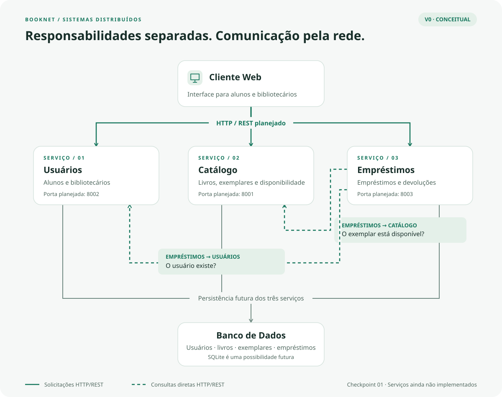

# BookNet

**Sistema Distribuído de Gerenciamento de Biblioteca Universitária**  
Disciplina: Sistemas Distribuídos  
Entrega atual: **Checkpoint 01 / V0 — Ideia e arquitetura**

## Integrantes

- André
- João Henrique
- Luiz Felipe

## Sobre o projeto

O BookNet é um projeto acadêmico da disciplina de Sistemas Distribuídos voltado ao gerenciamento de uma biblioteca universitária. Seu desenvolvimento será incremental ao longo do semestre, relacionando cada versão aos conceitos estudados em aula.

A V0 reúne a proposta, a estrutura inicial do projeto, a documentação da arquitetura e um dashboard estático de apresentação. As funcionalidades da biblioteca e as comunicações entre serviços descritas neste documento representam o planejamento das próximas versões.

## Problema

Uma biblioteca universitária precisa manter informações coerentes sobre seus usuários, acervo e circulação de exemplares. Esse gerenciamento envolve:

- Identificar os usuários e distinguir alunos de bibliotecários.
- Organizar os dados dos livros, como título, autor e ISBN.
- Diferenciar cada livro de seus exemplares físicos e acompanhar a disponibilidade de cada exemplar.
- Relacionar empréstimos a usuários e exemplares, registrando datas e previsão de devolução.
- Registrar devoluções e refletir a disponibilidade do exemplar para novos empréstimos.

Ao distribuir essas responsabilidades, o projeto também precisa considerar a comunicação pela rede e situações em que os componentes recebem solicitações simultâneas ou deixam de responder.

## Objetivo

O objetivo geral é desenvolver um sistema de gerenciamento de biblioteca universitária que organize usuários, livros, exemplares, empréstimos e devoluções em componentes com responsabilidades definidas.

O objetivo acadêmico é estudar comunicação entre processos e distribuição de responsabilidades, observando seus efeitos sobre concorrência, consistência, disponibilidade, escalabilidade e tolerância a falhas. A implementação desses conceitos ocorrerá gradualmente durante a disciplina.

## Usuários

Os dois perfis abaixo compõem o escopo funcional planejado. Suas operações ainda não estão implementadas na V0.

### Aluno

- Pesquisar livros.
- Verificar disponibilidade.
- Solicitar empréstimos.
- Realizar devoluções.
- Consultar seus empréstimos.

### Bibliotecário

- Cadastrar livros.
- Alterar dados dos livros.
- Consultar usuários.
- Acompanhar empréstimos.

## Escopo inicial

O escopo inicial do sistema a ser desenvolvido inclui:

| Área | Responsabilidade prevista |
| --- | --- |
| Catálogo | Organizar as informações dos livros e permitir sua pesquisa. |
| Usuários | Gerenciar os dados de alunos e bibliotecários. |
| Exemplares | Identificar as unidades físicas de cada livro e sua disponibilidade. |
| Empréstimos | Registrar e consultar a relação entre usuário, exemplar e datas do empréstimo. |
| Devoluções | Registrar a devolução e a mudança de estado do empréstimo e do exemplar. |
| Comunicação entre componentes | Permitir solicitações e respostas pela rede entre cliente e serviços e nas consultas entre serviços. |

Na V0, esse escopo está definido conceitualmente. A entrega implementada é o dashboard de apresentação; os serviços e as operações de gerenciamento serão construídos nas etapas seguintes.

## Fora do escopo inicial

- Pagamentos.
- Multas complexas.
- Recomendação com IA.
- Aplicativo mobile.
- Reconhecimento facial.
- Integrações externas.

## Arquitetura



A arquitetura definida para o BookNet possui cinco componentes:

1. Cliente Web.
2. Serviço de Usuários.
3. Serviço de Catálogo.
4. Serviço de Empréstimos.
5. Banco de Dados.

O Cliente Web se comunicará com os serviços por HTTP/REST. Os serviços acessarão conceitualmente o Banco de Dados, e o Serviço de Empréstimos também consultará diretamente os serviços de Usuários e Catálogo.

O banco permanece como um único componente conceitual compartilhado neste desenho inicial. O cliente não acessará o banco diretamente. As setas do diagrama indicam o sentido das solicitações; as respostas retornarão ao solicitante.

A [documentação da arquitetura](docs/arquitetura.md) detalha os componentes, modelos e interações planejadas.

## Componentes

### Cliente Web

Será a interface utilizada por alunos e bibliotecários para acessar as funcionalidades da biblioteca e enviar requisições HTTP aos serviços.

Na V0, o diretório `dashboard/` contém a apresentação acadêmica do projeto em HTML, CSS e JavaScript puro. Essa apresentação não realiza pesquisas no acervo, autenticação ou processamento de empréstimos.

### Serviço de Usuários

Será responsável pelos dados dos alunos e bibliotecários e pelas consultas necessárias para identificar um usuário.

**Modelo conceitual — `Usuario`:**

| Campo | Significado |
| --- | --- |
| `id` | Identificador do usuário. |
| `nome` | Nome do aluno ou bibliotecário. |
| `email` | E-mail do usuário. |
| `matricula` | Identificação institucional do usuário. |
| `tipo` | Perfil do usuário: `ALUNO` ou `BIBLIOTECARIO`. |

### Serviço de Catálogo

Será responsável pelos livros e seus exemplares. Um livro representa a obra cadastrada, enquanto um exemplar representa uma unidade física disponível para circulação.

**Modelo conceitual — `Livro`:**

| Campo | Significado |
| --- | --- |
| `id` | Identificador do livro. |
| `titulo` | Título da obra. |
| `autor` | Autor da obra. |
| `isbn` | Identificador ISBN da obra ou edição. |

**Modelo conceitual — `Exemplar`:**

| Campo | Significado |
| --- | --- |
| `id` | Identificador do exemplar físico. |
| `livro_id` | Referência ao livro correspondente. |
| `status` | Situação do exemplar: `DISPONIVEL` ou `EMPRESTADO`. |

### Serviço de Empréstimos

Será responsável pelos empréstimos e devoluções. Antes de registrar um empréstimo, consultará Usuários para verificar o usuário e Catálogo para verificar a disponibilidade do exemplar.

**Modelo conceitual — `Emprestimo`:**

| Campo | Significado |
| --- | --- |
| `id` | Identificador do empréstimo. |
| `usuario_id` | Referência ao usuário solicitante. |
| `exemplar_id` | Referência ao exemplar emprestado. |
| `data_emprestimo` | Data de registro do empréstimo. |
| `data_prevista_devolucao` | Prazo previsto para a devolução. |
| `data_devolucao` | Data da devolução efetiva; sem valor enquanto ela não ocorrer. |
| `status` | Situação do empréstimo: `ATIVO` ou `DEVOLVIDO`. |

### Banco de Dados

Persistirá futuramente os usuários, livros, exemplares e empréstimos, incluindo as informações de devolução registradas em `Emprestimo`.

SQLite é a opção inicialmente planejada para a primeira implementação. A tecnologia de persistência poderá evoluir durante a disciplina. Na V0, não há banco funcional, tabelas ou migrações; os modelos apresentados são exclusivamente conceituais.

## Comunicação entre componentes

| Origem | Destino | Comunicação e finalidade planejadas |
| --- | --- | --- |
| Cliente Web | Serviços de Usuários, Catálogo e Empréstimos | HTTP/REST para enviar solicitações relacionadas às responsabilidades de cada serviço e receber suas respostas. |
| Serviço de Empréstimos | Serviço de Usuários | HTTP/REST para verificar se o usuário existe e está apto a solicitar um empréstimo, conforme critérios a definir. |
| Serviço de Empréstimos | Serviço de Catálogo | HTTP/REST para verificar a disponibilidade do exemplar. |
| Serviços | Banco de Dados | Consulta e persistência dos dados sob responsabilidade de cada serviço; o protocolo de acesso ao banco ainda não foi definido. |

A arquitetura atual já prevê a verificação de existência do usuário. Os critérios de aptidão para empréstimo ainda serão definidos nas próximas etapas, sem acrescentar campos ou regras de negócio ao modelo da V0.

Todas essas interações representam a arquitetura planejada. **Nenhuma comunicação com backend ou entre serviços está implementada na V0.** O eventual servidor HTTP usado para abrir o dashboard apenas entrega arquivos estáticos.

## Exemplo de fluxo de empréstimo

O fluxo abaixo representa o comportamento futuro do sistema:

1. O usuário seleciona um livro pelo Cliente Web.
2. O cliente solicita o empréstimo ao Serviço de Empréstimos.
3. Empréstimos consulta o Serviço de Usuários para verificar a existência do usuário; os critérios adicionais de aptidão serão detalhados posteriormente.
4. Empréstimos consulta o Serviço de Catálogo para verificar a disponibilidade do exemplar.
5. Se o usuário existir e o exemplar estiver disponível, o empréstimo é registrado no Banco de Dados, conforme o fluxo conceitual definido na V0.
6. A resposta retorna ao Cliente Web, que apresenta a confirmação ao usuário.

```text
Aluno seleciona um livro
        ↓
Cliente Web
        ↓ POST /emprestimos (planejado)
Serviço de Empréstimos
        ├──→ Serviço de Usuários: o usuário existe?
        └──→ Serviço de Catálogo: o exemplar está disponível?
        ↓ Se as verificações forem positivas
Registro do empréstimo → Banco de Dados
        ↓
Resposta → Cliente Web → Aluno
```

`POST /emprestimos` é um exemplo conceitual, sem rota implementada. A coordenação das mudanças de estado do empréstimo e do exemplar será estudada nas próximas versões.

## Situações de falha

### 1. Serviço de Empréstimos indisponível

**Cenário:** o Serviço de Empréstimos fica offline enquanto os demais componentes podem continuar disponíveis.

**Consequência:** o usuário não consegue realizar empréstimos. A consulta ao catálogo ainda poderá funcionar se os componentes necessários a essa consulta estiverem disponíveis.

**Conceitos relacionados:** disponibilidade e tolerância a falhas.

### 2. Dois usuários solicitam o mesmo exemplar simultaneamente

**Cenário:** dois usuários tentam pegar o mesmo exemplar ao mesmo tempo, e suas solicitações observam o exemplar como disponível.

**Consequência:** sem controle adequado, podem ser registrados dois empréstimos para um único exemplar físico.

**Conceitos relacionados:** concorrência e consistência.

### 3. Falha de comunicação entre Empréstimos e Catálogo

**Cenário:** o Serviço de Empréstimos consulta o Serviço de Catálogo, mas a rede falha ou a resposta não chega.

**Consequência:** não é possível confirmar a disponibilidade do exemplar nem concluir com segurança as verificações necessárias ao empréstimo.

**Conceitos relacionados:** rede, timeout, comunicação distribuída e tolerância a falhas.

Essas três falhas foram identificadas e documentadas na V0. Serão estudadas nas próximas etapas da disciplina, quando serão desenvolvidas e avaliadas soluções. Nenhum mecanismo de tratamento dessas falhas está implementado nesta entrega.

## Por que o BookNet deve ser distribuído?

O BookNet adota uma arquitetura distribuída como proposta para separar as diferentes responsabilidades do sistema. O gerenciamento de usuários, catálogo e empréstimos será realizado por componentes independentes que se comunicarão pela rede. Essa separação permitirá que os serviços evoluam independentemente e possibilitará estudar conceitos fundamentais de Sistemas Distribuídos, como comunicação entre processos, concorrência, disponibilidade, escalabilidade e tolerância a falhas.

Além disso, uma falha em determinado serviço não precisa necessariamente interromper todas as funcionalidades. Esse comportamento dependerá das relações entre os componentes: solicitar um empréstimo exige consultas a outros serviços, e o banco compartilhado também constitui uma dependência da arquitetura inicial.

> Para uma biblioteca pequena, uma aplicação monolítica poderia ser suficiente. Neste projeto, a arquitetura distribuída foi escolhida principalmente para permitir a aplicação prática dos conceitos estudados na disciplina.

## Tecnologias planejadas

| Tecnologia | Uso |
| --- | --- |
| Python | Backend planejado. |
| FastAPI | APIs HTTP planejadas. |
| HTML/CSS/JavaScript | Cliente Web planejado e dashboard estático já implementado na V0. |
| SQLite | Banco inicial planejado. |
| PostgreSQL | Possível evolução da persistência. |
| Git | Versionamento do código e da documentação. |
| GitHub | Hospedagem do repositório e apresentação do projeto. |
| Docker | Conteinerização em etapa futura. |

As tecnologias futuras ainda podem mudar conforme os conteúdos e as necessidades da disciplina. A tabela não indica que ferramentas ou serviços já foram instalados ou configurados. O dashboard atual usa apenas HTML, CSS e JavaScript puro, sem bibliotecas ou dependências externas; o backend e o banco ainda não foram implementados.

## Portas planejadas

| Serviço | Porta |
| --- | --- |
| Catálogo | 8001 |
| Usuários | 8002 |
| Empréstimos | 8003 |

Essas portas são convenções iniciais e podem ser alteradas durante a evolução do projeto. Elas não representam serviços em execução na V0.

## Estrutura do projeto

A estrutura atual da pasta `booknet/` no workspace é:

```text
booknet/
├── README.md
├── .gitignore
├── docs/
│   ├── arquitetura.md
│   └── arquitetura.svg
├── dashboard/
│   ├── index.html
│   ├── style.css
│   └── script.js
├── servico-catalogo/
│   └── .gitkeep
├── servico-usuarios/
│   └── .gitkeep
├── servico-emprestimos/
│   └── .gitkeep
└── banco/
    └── .gitkeep
```

As pastas dos serviços e do banco contêm apenas `.gitkeep`, utilizado para manter diretórios reservados no versionamento. Os arquivos de arquitetura estão em `docs/`, e a apresentação visual está em `dashboard/`.

## Evolução

| Versão | Etapa | Status |
| --- | --- | --- |
| **V0** | **Ideia e arquitetura** | **Concluída** |
| V1 | Cliente-servidor | Próxima |
| V2 | Sockets / mensagens | Planejada |
| V3 | Serviços separados | Planejada |
| V4 | Docker | Planejada |
| V5 | Falhas e recuperação | Planejada |
| V6 | Orquestração | Planejada |

Somente a V0 está concluída. Esta tabela deverá ser atualizada conforme as entregas forem realizadas ao longo do semestre.

## Dashboard

O dashboard apresenta visão geral, arquitetura, componentes, comunicação, falhas e evolução. Possui layout responsivo, navegação suave, indicação da seção ativa, retorno ao topo e animações discretas. As interações são de apresentação e não processam operações da biblioteca.

### Abrir diretamente

Abra [dashboard/index.html](dashboard/index.html) no navegador. Os arquivos CSS e JavaScript são locais; o dashboard funciona sem instalação de dependências e sem conexão com a internet.

### Usar um servidor HTTP simples

Se o Python já estiver instalado, abra um terminal **dentro da pasta `booknet/dashboard/`** e execute:

```sh
python -m http.server 8000
```

Acesse [http://localhost:8000/](http://localhost:8000/). Para encerrar o servidor, pressione `Ctrl+C`.

Essa opção serve apenas os arquivos de `dashboard/`. Os links para `../docs/` ficam fora da pasta servida. Para acessar também a documentação pelo navegador, execute o mesmo comando **na pasta `booknet/`** e acesse [http://localhost:8000/dashboard/](http://localhost:8000/dashboard/). Encerre o servidor anterior antes de reutilizar a porta 8000.

Esse servidor é opcional e serve somente os arquivos estáticos; não inicia os serviços planejados do BookNet.

## Repositório

O código e a documentação estão no repositório [projeto-booknet no GitHub](https://github.com/luizfelipefelixalves41-dot/projeto-booknet).

Os diretórios `dashboard/`, `docs/`, `servico-catalogo/`, `servico-usuarios/`, `servico-emprestimos/` e `banco/` ficam diretamente na raiz do repositório. No workspace local, essa raiz corresponde à pasta `booknet/`.

## Estado atual

**Checkpoint 01 / V0 — Ideia e arquitetura concluída.**

| Entrega | Situação atual |
| --- | --- |
| Proposta e arquitetura conceitual | Concluídas, com cinco componentes definidos. |
| Documentação | Concluída para o Checkpoint 01: README, descrição da arquitetura e diagrama SVG. |
| Dashboard | Implementado como apresentação estática em HTML, CSS e JavaScript puro. |
| Estrutura inicial | Criada, com diretórios reservados para os serviços e o banco. |
| Backend e APIs | Ainda não implementados. |
| Banco de dados funcional | Ainda não implementado. |
| Autenticação e operações da biblioteca | Ainda não implementadas. |
| Comunicação entre serviços e tratamento de falhas | Planejados para as próximas versões. |
| Docker e orquestração | Etapas futuras. |

A próxima entrega prevista é a **V1 — Cliente-servidor**.
